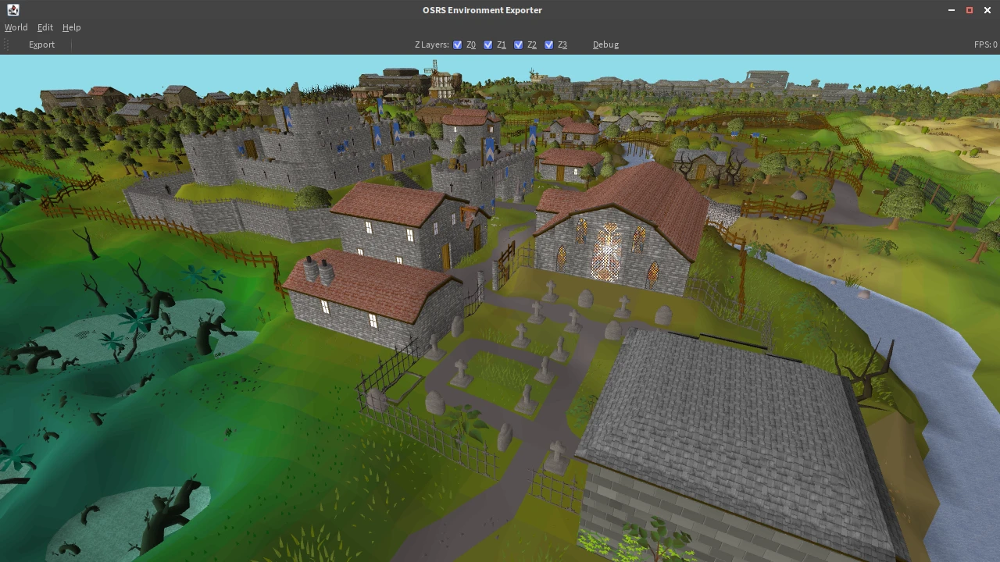

# OSRS Environment Exporter

Tool for exporting Old School RuneScape environments so that they can be used in 3D modeling programs like Blender.

[](https://www.youtube.com/watch?v=xAggnDgALck)

## Downloading

Please visit the [Releases](https://github.com/ConnorDY/OSRS-Environment-Exporter/releases) page to download the application.

We recommend using the latest release unless you are having problems with it.

## How to use

If you're on Windows, double click `run.bat` to launch the application.

If you're on macOS or Linux, open a terminal window, change directory to where you extracted the application, then execute the following command: `./run`.

[TheSkulled](https://www.youtube.com/channel/UC3NPPMYWrCH4oCFeKRf9Ltw) made a lovely [tutorial video](https://www.youtube.com/watch?v=NhqLDY9QH7k) for the exporter. Give it a watch! 👀

## Troubleshooting

If the application does not run, make sure you have JDK 11 or newer installed.

OpenJDK can be downloaded [here](https://learn.microsoft.com/en-us/java/openjdk/download).

To check which version of Java you have installed, open Command Prompt (or a terminal window if you're on Linux or macOS) and run the following command:
```bash
java --version
```

## Configuration

| Config                     | Type      | Default Value    | Description                                                                                                                                                                                                  |
|----------------------------|-----------|------------------|--------------------------------------------------------------------------------------------------------------------------------------------------------------------------------------------------------------|
| `alpha-mode`               | `Enum`    | `ORDERED_DITHER` | The type of alpha blending to use. One of `BLEND`, `CLIP`, `HASH`, `ORDERED_DITHER`, `HEX_DOTS`, `IGNORE`.                                                                                                   |
| `anti-aliasing`            | `Enum`    | `MSAA_16`        | The multisampling depth to use. One of `DISABLED`, `MSAA_2`, `MSAA_4`, `MSAA_8`, `MSAA_16`.                                                                                                                  |
| `check-for-updates`        | `Boolean` | `true`           | If enabled, will check for newer versions of the application after the cache chooser screen.                                                                                                                 |
| `debug`                    | `Boolean` | `false`          | If enabled, the cache chooser will load the most recently used cache automatically, and a small suite of debug options will be accessible from the toolbar.                                                  |
| `fov`                      | `Double`  | `90.0`           | The field of view to use for the camera, in degrees, relative to the width of the viewport.                                                                                                                  |
| `fps-cap`                  | `Int`     | `0`              | Caps the frame rate (FPS) to the provided value. A value of `0` means no cap.                                                                                                                                |
| `initial-radius`           | `Int`     | `1`              | The initial radius to load.                                                                                                                                                                                  |
| `initial-region-id`        | `Int`     | `15256`          | The initial region to load.                                                                                                                                                                                  |
| `last-cache-dir`           | `String`  | Empty            | The last cache that was used.                                                                                                                                                                                |
| `last-checked-for-updates` | `Long`    | `0`              | The last time an update check was performed, in unix timestamp format. Used to limit the number of requests made to GitHub's servers.                                                                        |
| `mouse-warping`            | `Boolean` | Varies           | If enabled, the mouse will warp from one edge to the other if it leaves the window while the camera is being dragged. Disabled by default on MacOS due to permissions requirements, enabled everywhere else. |
| `power-saving-mode`        | `Boolean` | `false`          | If enabled, will attempt to keep the idle frame rate as low as possible without impacting usability.                                                                                                         |
| `priority-renderer`        | `Enum`    | Varies           | The face-sorting renderer to use. May not actually sort faces. One of `GLSL`, `CPU_NAIVE`. Set to `CPU_NAIVE` on MacOS due to missing compute shader support, and `GLSL` everywhere else.                    |
| `sample-shading`           | `Boolean` | `false`          | If enabled, tells OpenGL to shade sub-samples in MSAA (OpenGL 4.0+).                                                                                                                                         |
| `scale-mode`               | `Enum`    | `SCALE_1TO128`   | The scaling mode to use. One of `SCALE_1TO1`, `SCALE1TO100`, `SCALE_1TO128`. See also `--scale`.                                                                                                             |

## Development

### Build

```bash
./gradlew build
```

### Run

```bash
./run
```

### Lint

```bash
./gradlew ktlintCheck # check linting
```

```bash
./gradlew ktlintFormat # apply automated linting fixes
```

## Credits

Based on [@tpetrychyn](https://github.com/tpetrychyn)'s [OSRS Map Editor](https://github.com/tpetrychyn/osrs-map-editor).

Using changes from [@partyvaper](https://github.com/partyvaper)'s [fork](https://github.com/partyvaper/osrs-map-editor).

