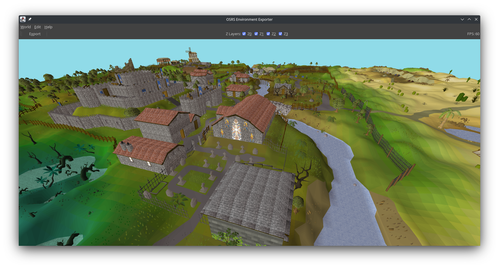

# OSRS Environment Exporter

Tool for exporting Old School RuneScape environments so that they can be used in 3D modeling programs like Blender.



## Downloading

Please visit the [Releases](https://github.com/ConnorDY/OSRS-Environment-Exporter/releases) page to download the application.

We recommend using the latest release unless you are having issues with it.

## Configuration

| Config           | Type      | Default Value | Description                                                                                                  |
|------------------|-----------|---------------|--------------------------------------------------------------------------------------------------------------|
| `debug`          | `Boolean` | `false`       | Enabling the `debug` option will skip the cache chooser and load the most recently used cache automatically. |
| `fps-cap`        | `Int`     | `0`           | Caps the frame rate (FPS) to the provided value.                                                             |
| `initial-radius` | `Int`     | `1`           | The initial radius to load.                                                                                  |
| `initial-region` | `Int`     | `15256`       | The initial region to load.                                                                                  |
| `last-cache-dir` | `String`  | N/A           | The last cache that was used.                                                                                |

## Development

### Build

```bash
./gradlew build
```

### Run

```bash
./run
```

### Lint

```bash
./gradlew ktlintCheck # check linting
```

```bash
./gradlew ktlintFormat # apply automated linting fixes
```

## Credits

Original idea by [Trillion](https://twitter.com/TrillionStudios).

Based on [@tpetrychyn](https://github.com/tpetrychyn)'s [OSRS Map Editor](https://github.com/tpetrychyn/osrs-map-editor).

Using changes from [@partyvaper](https://github.com/partyvaper)'s [fork](https://github.com/partyvaper/osrs-map-editor).

## Donate

If you would like to financially support the primary developers ([@ScoreUnder](https://github.com/ScoreUnder) & [@ConnorDY](https://github.com/ConnorDY)) of the OSRS Environment Exporter, click the button below: [^1]

[](https://www.paypal.com/donate/?business=DVHHXKWFYZUJL&no_recurring=0&item_name=Donations+will+go+directly+to+the+primary+developers+%28score+and+wiz%29+of+the+OSRS+Environment+Exporter.&currency_code=USD)

[^1]: Donating will not guarantee that more time is spent developing this application.
